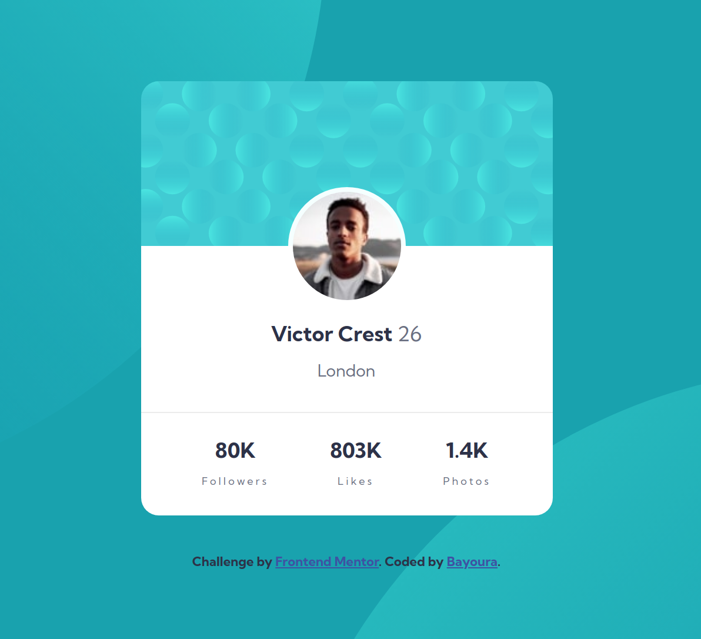

# Frontend Mentor - Profile card component solution

This is a solution to the [Profile card component challenge on Frontend Mentor](https://www.frontendmentor.io/challenges/profile-card-component-cfArpWshJ). Frontend Mentor challenges help you improve your coding skills by building realistic projects. 

## Table of contents

- [Overview](#overview)
  - [The challenge](#the-challenge)
  - [Screenshot of my result](#screenshot-of-my-result)
  - [Links](#links)
- [My process](#my-process)
  - [Built with](#built-with)
  - [What I learned](#what-i-learned)
  - [Continued development](#continued-development)
- [Author](#author)

## Overview

### The challenge

- Build out the project to the designs provided

### Screenshot of my result

### Links

- [View Code](https://github.com/Bayoura/profile-card-component)
- [Live Demo](https://bayoura.github.io/profile-card-component/)

## My process

### Built with

- HTML
- CSS
- Flexbox
- Mobile-first workflow

### What I learned
I learned a bit more about background images and how to position them. Also, I did some research about when to use `` and when to use the CSS property 
`background-image` instead. Moreover, I learned how to position an image (in this case, the profile picture) so that it overlaps two divs vertically. You can accomplish this by using the `position` property, but in this case it was easiest to use a negative `margin` on the image.

### Continued development
This project was rather easy for me, which encourages me to move on to assignments that are a little bit more difficult.   
Until now I was hesitant to work on projects that required the use of JavaScript (even though I have done some) because that's the skill I am least experienced with. That's exactly why I *should* dive into those kinds of projects in the future. I want to focus on getting more comfortable with JavaScript.

## Author

- [codepen](https://codepen.io/bayoura)
- [GitHub](https://github.com/Bayoura)
- [Frontend Mentor](https://www.frontendmentor.io/profile/Bayoura)
